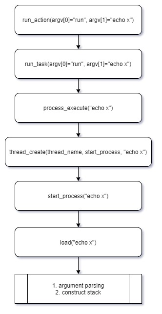
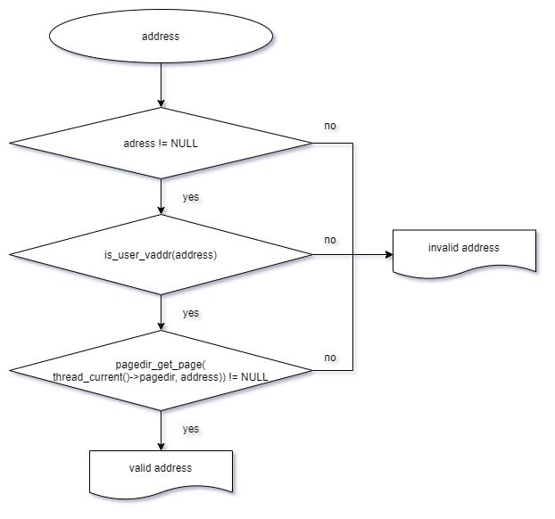
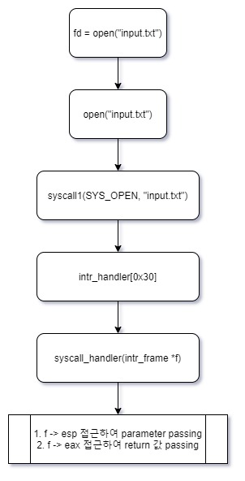
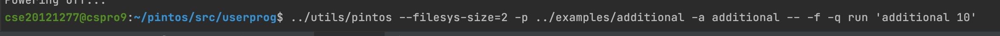
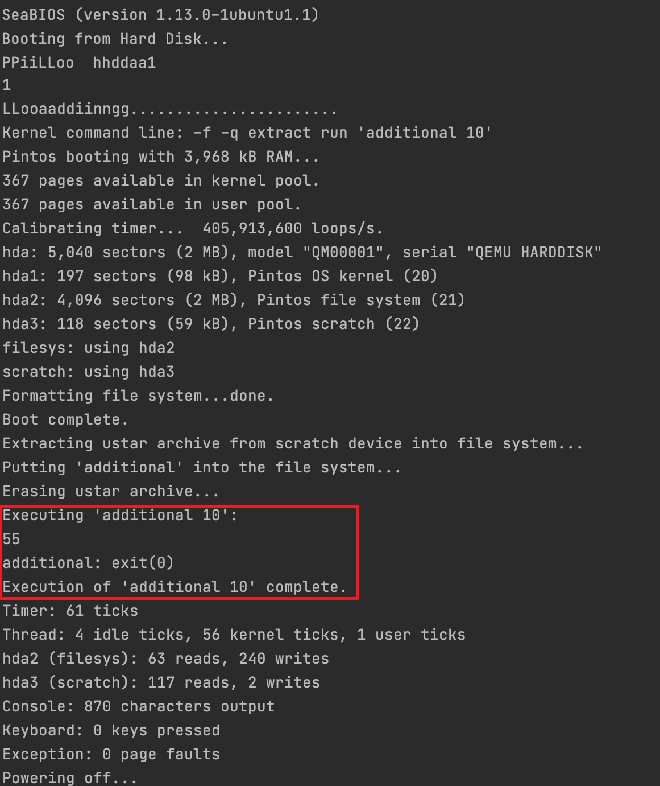
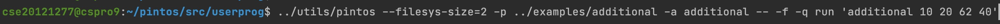
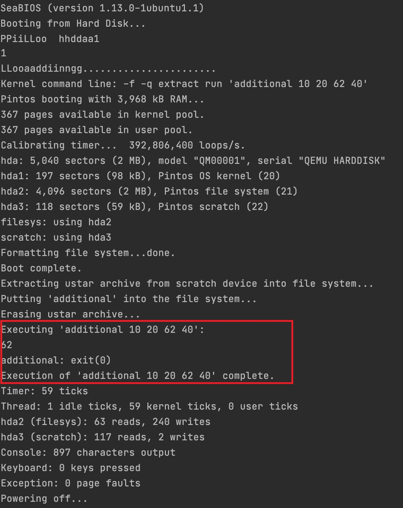

# 1. 개발 목표

user level과 kernel level이 분리된 pintos OS 환경에서, kernel level에 존재하는 system 함수들을 이용하여 user level에 있는 프로그램을 구동시키는 로직을 구현한다.

# 2. 개발 범위 및 내용

## A. 개발 범위

### 1. Argument Passing

- 사용자가 입력한 명령어를 parsing하여 esp 레지스터가 가리키는 메모리 공간에 적재한다.
- user level에서 호출한 api를 수행하는 데 필요한 정보들(인자, 인자 개수, 인자의 주소 등)이 전달된다.

### 2. User Memory Accesss

- user level에서 호출한 api가 kernel level의 메모리를 침범하지 않도록 유효성을 판단한다.

### 3. System Calls 

- 유저 레벨에서 시스템 콜 API를 호출하고, system call 함수를 이용해 커널 레벨의 함수를 사용할 수 있게 된다.


## B. 개발 내용

### 1. Argument Passing

- 커널 내 스택에 argument를 쌓는 과정 설명

  - esp 레지스터가 가리키는 메모리 공간에 argument를 stack한다.

  - argument를 메모리에 stack할 때는 pintos에서 제시하는 컨벤션대로 쌓게 되는데, 그 규칙은 아래와 같다.

  - | argv\[2\]\[...\] |
    | ---------------- |
    | argv\[1\]\[...\] |
    | argv\[0\]\[...\] |
    | \<word-align\>   |
    | NULL             |
    | argv[2]          |
    | argv[1]          |
    | argv[0]          |
    | argv             |
    | argc             |
    | return address   |


### 2. User Memory Accesss

- Pintos 상에서의 invalid memory access 개념
  - Pintos는 user level과 kernel level의 환경이 분리되어있다.
  - 여기서 2가지 형태의 invalid memory access가 생길 수 있다.
  - 첫 번째는 user level에서 구동되는 APP1이 APP2가 사용하는 메모리 공간을 침범하는 것이다.
  - 두 번째는 usel level에서 구동되는 APP이 kernel level의 메모리 공간을 침범하는 것이다.
- Invalid memory access를 막는 방법
  - Virtual Memory의 개념을 이용한다.
  - user level에서 구동되는 APP은 실행에 필요한 가상의 logical한 메모리 공간을 부여받고, 가상의 넓은 메모리공간을 점유하는 것처럼 동작한다.
  - 이 logical한 가상의 메모리 공간이 physical하게는 page 단위의 실제 메모리공간과 mapping되어, 한정된 공간만을 사용하게 된다.
  - APP1이 사용하는 physical 메모리 공간과 APP2가 사용하는 physical 메모리 공간이 서로 침범하지 않도록, 또한 user level에서 구동되는 APP이 kernel level의 메모리 공간을 침범하지 않도록 OS가 관리한다.


### 3. System Calls

- 시스템 콜의 필요성

  - user level과 kernel level이 분리된 OS 환경에서, user level이 kernel level의 메모리 공간을 침범하지 못하도록 관리된다.
  - 그러나, kernel level에는 Process Scheduling, Memory Management, File System 관련한 유용한 함수들이 내장되어 있고, 이를 user level에서 이용해야할 필요성이 생기게 된다.
  - user level에서 kernel level의 함수를 이용할 수 있게 해주는 것이 바로 system call이다.

- 이번 프로젝트에서 개발할 시스템 콜에 대한 간략한 설명

  - `halt()`
    - 핀토스를 종료시킨다.
  - `exit()`
    - 현재 실행시키고 있는 user program을 종료시키고, status를 kernel에 반환한다.
  - `exec()`
    - Child process 를 create하여, 프로그램을 수행시킨다.
  - `wait()`
    - child process의 작업이 끝날 때까지 기다리며, child thread의 id가 유효한지 점검한다.
    - child process가 종료된 때의 status를 받고, 해당 자식 프로세스를 reap한다.
  - `read(STDIN)`
    - 표준 입력 스트림으로부터 데이터를 읽는다.
  - `write(STDOUT)`
    - 표준 출력 스트림으로 데이터를 출력한다.

  ​

- 유저 레벨에서 시스템 콜 API를 호출한 이후 커널을 거쳐 다시 유저 레벨로 돌아올 때까지 각 요소를 설명

  - 유저 레벨에서 시스템 콜 API를 호출한다.
  - system call 함수는 API에 대응하는 system call number와 인자를 system call handler에게 전달한다.
  - system call handler는 system call과 인자를 이용해 esp 레지스터에 접근해서 argument를 넘긴다.
  - kernel 레벨에서 system call이 수행된 후 return 값을 eax 레지스터에 넘겨 주게 되면, 이를 유저 레벨에서 읽어들인다.


# 3. 추진 일정 및 개발 방법

## A. 추진 일정

- **day1**. argument passing 구현
  - esp 레지스터가 가리키는 메모리 공간에 pintos 컨벤션에 맞게 argument를 쌓아 넘기는 로직 구현 
- **day2**. user memory access
  - 인자로 넘긴 argument들이 kernel level의 메모리를 침범하지 않는지 유효성을 검사하는 로직 구현
- **day3**. System Call handler
  - system call number와 인자를 통해, 적절한 system 함수를 호출할 수 있도록 분기문 구현
- **day4**. System call implementation
  - kernel level 함수를 호출하여, 수행 결과 값을 eax 레지스터에 전달하는 로직 구현
- **day5**. additional implementation
  - 새로운 system call number를 정의하고, 새로운 system call 함수를 정의한다.


## B. 개발 방법

- `src/userprog/process.c`
  - `bool load()` 함수 수정
    1. argument parsing 함수 추가
    2. push_to_stack 함수 추가
- `src/userprog/syscall.c`
  - 넘어온 argument들의 유효성을 검사하는 함수 추가
  - systemcall number를 확인하여, kernel level의 함수를 호출하는 분기문 작성
    - f -> esp에 접근하여 parameter passing을 구현
    - f -> eax에 접근하여 함수의 return 값을 passing
  - 새로운 additional 함수 `fibonacci()`, `max_of_four_int()` 작성
- `src/lib/syscall-nr.h`
  - 새로운 system call number 등록
    - `SYS_FIB` (20번)
    - `SYS_MAX` (21번)
- `src/userprog/user/syscall.c`
  - fibonacci와 max_of_four_int 관련한 syscall 함수 작성
- `src/examples/additional.c`
  - examples 폴더에 additional.c 파일을 추가하고, `fibonacci`와 `max_of_four_int`를 호출할 수 있도록 만든다.


# 4. 연구 결과

## A. Flow Chart

### 1. Argument Passing




### 2. User Memory Accesss




### 3. System Calls




## B. 제작 내용

###  1. Argument Passing

- `src/userprog/process.c`
  - `bool load()` 함수 내에 argument parsing 관련 코드 작성
    - \<string.h\> header에 있는 strtok_r() 함수를 사용
      - strtok()와는 달리 strtok_r()은 multi thread 환경에서 사용이 가능하도록 만들어진 함수이다.
  - `void push_to_stack(char**, void**, int)` 함수 추가
    - Pintos 컨벤션에 맞도록 함수의 인자와 주솟값, 인자의 개수, return address 등 함수 수행과 관련한 정보들을 stack에 push한다.
    - esp 레지스터의 값을 4 단위로 감소 시키면서 push한다.


### 2. User Memory Accesss

- `src/userprog/syscall.c`

  - `bool is_valid_ptr(const void *usr_addr)`

    - 넘어온 argument들의 유효성을 검사하는 함수이다.

    ```c
    bool is_valid_ptr(const coid *usr_addr){
      struct thread * cur = thread_current();
      if (usr_addr == NULL) return false;
      if (!is_user_vaddr(usr_addr)) return false;
      
      return (page_dir_page(cur->pagedir, usr_addr)) != NULL;
    }
    ```

    - `src/userprog/pagedir.h`에 내장된 page_dir_page(cur->pagedir, usr_addr) 를 사용한다.

      - 해당 함수는 user virtual address에 대해 kernel virtual address를 구해주게 된다
      - physical page에 unmapped 되어 있다면, NULL을 return 하게 된다.

    - `src/threads/vaddr.h`에 내장된 is_user_vaddr(usr_addr)를 사용한다.

      - 해당 함수는 인자로 들어온 address가 user level에 있는지를 점검한다.

      ​

### 3. System Calls

- `src/userprog/syscall.c`

  - `static void syscall_handler(struct intr_frame *f UNUSED)` 작성

    - system call number를 확인하여, kernel level의 함수를 호출하는 분기문 작성
      - 인자로 들어온 `struct intr_frame *f` 값을 통해서 esp 레지스터가 담고 있는 주솟값에 접근할 수가 있다.
      - 그 주소가 유효한 주소인지를 점검한다.
      - syscall number를 살펴보고, 적절한 수행 함수를 찾아 분기한다. (switch문)
      - f -> esp에 접근하여 parameter를 passing하고, f -> eax에 return 값을 넘겨준다.

  - `sys_read()` 작성

    - `src/devices/input.c` 에 내장된 `input_getc(void)` 이용

  - `sys_write()` 작성

    - `src/lib/kernel/console.c`에 내장된 `putbuf()` 이용

  - `sys_halt()` 작성

    - `src/devices/shutdown.h`에 내장된 `shutdown_power_off()` 이용

  - `sys_exit()` 작성

    - `src/threads/thread.h`에 내장된 `thread_exit()` 이용하여 프로세스를 종료

  - `sys_exec()` 작성

    - **Logic**

      - ```c
        case SYS_EXEC :
                {
                    int arg = get_arg(f);
                    arg = usr_to_kernel_ptr((const void *) arg);
                    f->eax = process_execute((const char *) arg);
                    break;
                }
        ```

      - intr_frame에 접근하여 인자를 얻어 온다. (`get_art(intr_fame)`)

      - 얻어온 인자 addr를 이용해 실제 mapping 되어있는 physical page 주소를 얻는다. (`usr_to_kernel_ptr(addr)`)

      - bad address 인지를 점검하고 이상이 없다면, `src/userprog/process.c`에 내장된 `process_execute()`의 parameter로 넘겨 user level api 수행

    - **Codes**

      - `int get_arg (struct intr_frame *f)`

        - intr_frame에 접근하여 인자를 얻어오는 함수이다.

        - ```c
          int get_arg (struct intr_frame *f) {
              int *addr = (int *) f->esp + 1;
              if (!is_user_vaddr((const void *) addr)) sys_exit(-1);
              if ((const void *) addr < USER_VADDR_BOTTOM) sys_exit(-1);

              return *addr;
          }
          ```

          ​

      - `int usr_to_kernel_ptr(const void *usr_addr)`

        - user address에 mapping된 physical address를 얻는 함수이다.

        - ```c
          int usr_to_kernel_ptr(const void *usr_addr) {
              if (!is_user_vaddr(usr_addr)) sys_exit(-1);
              if (usr_addr < USER_VADDR_BOTTOM) sys_exit(-1);

              void *k_virtaddr = (void *)pagedir_get_page(thread_current()->pagedir, usr_addr);
              if (!k_virtaddr) sys_exit(-1);

              return (int)k_virtaddr;
          }
          ```

      ​

### 4. Additional System calls

- `src/examples/additional.c`
  - pintos가 kernel level api를 이용할 때, `src/examples` 디렉토리에서 simulated disk로 코드를 옮기게 된다.

  - `src/examples` 디렉토리에 새로운 파일 `additional.c`를 만들고, argc에 따라 분기하여 함수를 호출할 수 있도록 코드 작성

    - ```c
      #include <stdio.h>
      #include <syscall.h>
      #include <stdlib.h>

      int
      main (int argc, char *argv[])
      {
          switch(argc){
              case 2:
              {
                  printf("%d\n", fibonacci(atoi(argv[1])));
                  return EXIT_SUCCESS;
                  break;
              }
              case 5:
              {
                  printf("%d\n", max_of_four_int(atoi(argv[1]), atoi(argv[2]), atoi(argv[3]), atoi(argv[4])));
                  return EXIT_SUCCESS;
                  break;
              }
              default:
                  break;
          }

          return EXIT_FAILURE;
      }
      ```

      ​

- `src/lib/syscall-nr.h`

  - 새로운 systemcall number를 등록한다.

  - ```c
    /* System call numbers. */
    enum
    {
        /* Projects 2 and later. */
        SYS_HALT,                   /* Halt the operating system. */
        SYS_EXIT,                   /* Terminate this process. */
        SYS_EXEC,                   /* Start another process. */
        
          ...

        // programmer-defined
        SYS_FIB,
        SYS_MAX
    };
    ```

- `src/lib/user/syscall.c`

  - max_of_four_int()의 경우 4개의 인자를 passing하게 된다.

  - 인자 4개가 들어오는 경우의 syscall handler를 assembly level에서 구현한다.

  - ```c
    // programmer-defined
    #define syscall4(NUMBER, ARG0, ARG1, ARG2, ARG3)				\
    		({														\
    		  int retval;											\
    		  asm volatile											\
    			("pushl %[arg3]; pushl %[arg2]; pushl %[arg1]; pushl %[arg0]; "	\
    			 "pushl %[number]; int $0x30; addl $20, %%esp"					\
    			   : "=a" (retval)									\
    			   : [number] "i" (NUMBER),							\
    			     [arg0] "r" (ARG0),								\
    				 [arg1] "r" (ARG1),								\
    				 [arg2] "r" (ARG2),								\
    				 [arg3] "r" (ARG3)								\
    			   : "memory");										\
    			retval;												\
    		})
    ```

    ​

  - syscall 함수 정의

    - ```c
      int
      fibonacci (int n)
      {
          return syscall1 (SYS_FIB, n);
      }

      int max_of_four_int(int a, int b, int c, int d)
      {
          return syscall4 (SYS_MAX, a, b, c, d);
      }
      ```

    ​

- `src/userprog/syscall.c`

  - 새로운 함수 `fibonacci()`, `max_of_four_int()` 작성

  - > `fibonacci()`

    ```c
    int sys_fibonacci (int n) {
        if (n == 1 || n == 2) return 1;

        int a, b;
        int tmp;

        a = b = 1;
        for (int i = 2; i < n; i++){
            tmp = a + b;
            a = b;
            b = tmp;
        }
        return b;
    }
    ```

  - > `max_of_four_int()`

    ```c
    int sys_max_of_four_int(int a, int b, int c, int d) {
        int mxv1 = a > b? a: b;
        int mxv2 = c > d? c: d;
        int res = mxv1 > mxv2? mxv1: mxv2;
        return res;
    }
    ```

  ​


## C.  시험 및 평가 내용

> 입력한 명령 - fibonacci 관련



> 수행 결과




> 입력한 명령 - max of four int 관련



> 수행 결과

