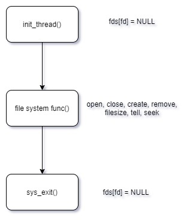
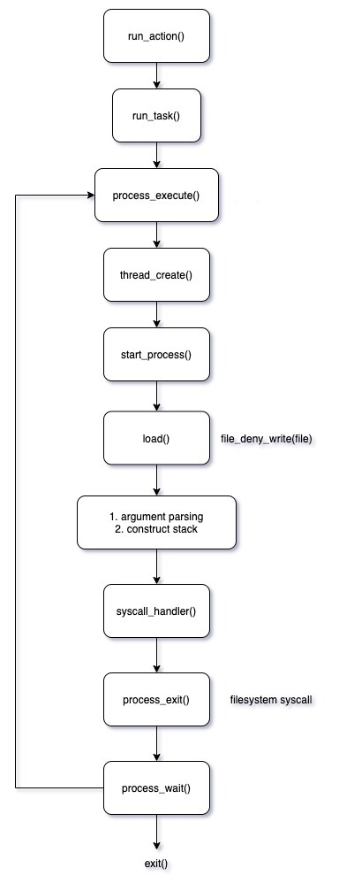
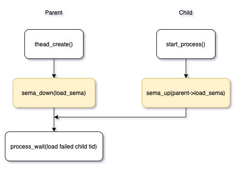
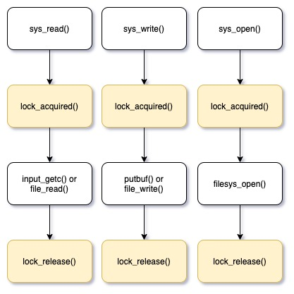
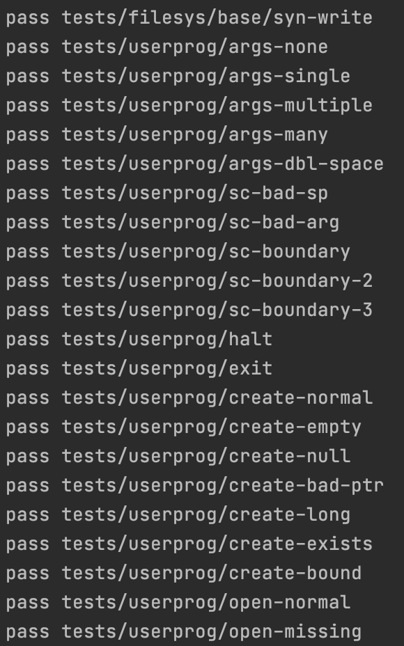
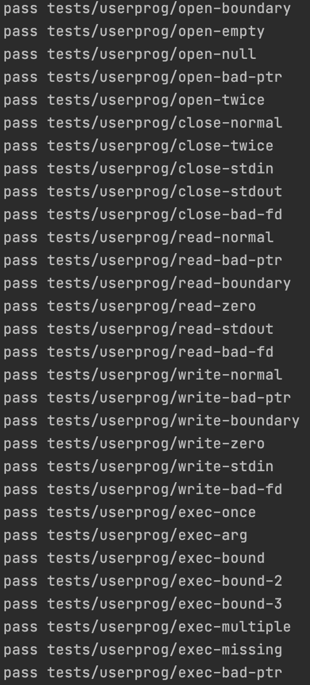
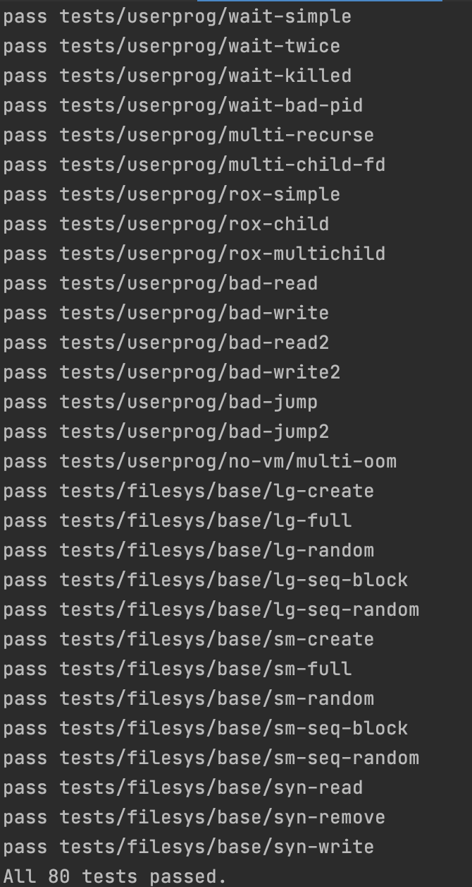

# 1. 개발 목표

proj1에 이어 file system과 관련한 system call을 추가로 구현한다. (`create`, `remove`, `open`, `close`, `filesize`, `read`, `write`, `seek`, `tell`)


# 2. 개발 범위 및 내용

## A. 개발 범위

### 1. File Descriptor

- 파일 디스크립터(file descriptor)는 리눅스 혹은 유닉스 계열의 시스템에서 프로세스(process)가 파일(file)을 다룰 때 사용하는 개념으로 0 아닌 정수값을 가진다.
- file descriptor를 사용하면, 프로세스(혹은 thread)가 핸들링하고 있는 파일에 접근할 수 있게 된다.

### 2. System Calls

- user level에서 명령을 입력하였을 때, 이 명령이 kernel level의 함수 사용을 필요로 하는 명령일 수 있다.
- system call handler를 통해 argument들을 가져와 file system 관련 명령을 수행할 수 있다. 

### 3. Synchronization in File system

- 여러 개의 thread가 concurrent하게 수행되면서 파일을 read 혹은 write할 때, 여러 thread에 의해 동일한 파일이 조작된다면, thread의 명령 실행이 의도한 바대로 동작하지 않는다.
- 파일을 읽고 쓰는 동안 thread가 그 해당 파일을 독점적으로 사용할 수 있도록하여 동기화할 수 있도록 한다.


## B. 개발 내용

### 1. File Descriptor

- file descriptor인 0, 1, 2, .. 인 integer가 곧바로 file 구조체를 지정할 수 있도록, 배열로 file descriptor를 관리한다.
- fd가 핸들링하는 file 구조체의 형태가 모두 동일하다는 면에서, 배열을 자료구조로 택할 수 있다.

### 2. System Calls

- `create`
  - 새로운 파일을 만든다. 성공적으로 만들어진다면, true를 반환
- `remove`
  - 파일을 삭제한다. 성공적으로 삭제된다면, true를 반환
- `open`
  - 파일을 연다. 성공적으로 파일을 연다면, file descriptor를 반환한다.
- `close`
  - file descriptor에 해당하는 파일을 닫는다.
- `filesize`
  - file descriptor에 해당하는 file의 byte size를 반환한다.
- `read`
  - buffer로부터 파일을 읽어들인다. read한 byte 수를 반환 한다.
- `write`
  - buffer의 byte size만큼 write를 수행한다. write 된 byte 수를 반환하게 된다.
- `seek`
  - 파일의 커서를 조정하는 함수이다.
- `tell`
  - 파일에서 현재 커서의 위치를 반환한다.

### 3. Synchronization in File system

- thread가 concurrent하게 수행되면서, 하나의 파일을 동시에 읽거나, 쓴다면 synchronization이 깨지게 된다.
- 파일을 읽거나 쓸 때, lock 구조체 변수를 선언하고 lock_acquire()를 수행하여, thread가 파일을 독점적으로 사용하도록 만든다. 
- 사용이 끝나면, lock_release()로 다른 thread가 해당 파일에 access할 수 있도록 만든다.
- parent가 child보다 먼저 죽게 되어, child가 고아가 되는 것을 방지해야 한다. 
- parent가 항상 child보다 나중에 죽을 수 있도록, Semaphore를 통해 synchronization을 달성한다. (sema_down()을 한 뒤, child를 reap할 수 있도록)

# 3. 추진 일정 및 개발 방법

## A. 추진 일정

- **day1 ~ day3.** base file system 구현
  - file system과 관련한 system call의 기틀이 되는 코드를 작성한다.
- **day4 ~ day7.** synchronization 및 예외처리 구현
  - thread 구조체의 속성을 추가로 정의하고, 이를 핸들링하면서 synchronization이 달성되도록 코드를 작성
- **day8 ~ day10.** 코드 정리 및 오류 디버깅
  - 더 가독성 있는 코드가 되도록 변수명과 함수명을 정리하고, 다른 오류들도 디버깅한다.


## B. 개발 방법

- `src/threads/thread.h`
  - `struct thread` 에 속성 추가
    - `struct semaphore load_sema` 를 추가하여, 자식의 load 성공 여부를 알기 전까지 parent가 먼저 죽는 경우를 방지한다.
    - `struct file* fds[FILE_NUM]` 추가
      - thread가 핸들링하는 file descriptor를 관리한다.

    - `struct file* handling_fp` 추가
      - thread가 핸들링하는 file descriptor가 가리키는 file 구조체를 속성으로 추가한다.

    - `struct thread* parent` 추가


- `src/threads/thread.c`
  - struct thread에 새로 추가한 속성에 관하여도 initialize를 수행하는 코드라인을 추가 작성

- `src/userprog/syscall.c`

  - 2개의 함수를 추가
    - `void sys_open(const char* file)`
      - 파일을 여는 함수
    - `void sys_close(int fd)`
      - 파일을 닫는 함수
  - 함수에 코드 추가, 보완
    - `void sys_exit (int status)`
      - file system 관련해 돌고 있는 thread에 대해, file을 close하고 reap하는 코드를 추가 작성
    - `int sys_read (int fd, void *buffer, unsigned length)`
      - proj1에서는 fd = 0 인 상황 즉, std input에 대해서 read하는 함수를 작성하였다.
      - proj2에서는 fd >= 3 인 상황에서도 file을 read할 수 있게 코드를 보완한다.
    - `int sys_write (int fd, const void *buffer, unsigned length)`
      - proj1에서는 fd = 1 인 상황 즉, std output에 대해서 write하는 함수를 작성하였다.
      - proj2에서는 fd >= 3 인 상황에서도 file에 write할 수 있게 코드를 보완한다.

- `src/userprog/process.c`

  - `static void start_process (void *file_name_)` 함수에 코드 추가

    - parent thread의 대기 상태를 풀어준다. (`sema_up(parent->tid)`)
    - child의 load가 성공 여부를 parent에게 알린다.

  - `tid_t process_execute (const char *file_name)` 함수에 코드 추가

    - thread_create() 직후에 child thread의 load 상태를 전달 받기 전까지, 대기한다. (`sema_down(tid)`)

    - child thread가 parent thread의 대기 상태를 풀면, child의 load 성공 여부를 보고, 혹 실패시(filename이 invalid하거나 등) parent가 이를 수거할 수 있도록 한다.

      

# 4. 연구 결과

## A. Flow Chart

### 1. File Descriptor



### 2. System Calls



### 3. Synchronization in File system





## B. 제작 내용

- `src/threads/thread.h`

  - `struct thread` 에 5가지의 속성을 추가로 부여한다.

    - `struct semaphore load_sema` 를 추가하여, 자식의 load 성공 여부를 알기 전까지 parent가 먼저 thread 실행을 마치는 경우를 방지한다.

      - child가 혹여 filename이 invalid하여 load가 실패 했을 시, parent가 이를 기다렸다가 reap해줄 수 있다.

      - parent는 `thread_create()` 직후에 대기한다. (`sema_down(sema)`)
      - child는 `start_process()`를 수행하면서, `load()` 직후에 parent의 sema를 up한다.(`sema_up(parent->sema)`)
      - 이로써, parent는 자식이 load가 완료가 되면, 혹여 filename이 잘못되어 load에 실패한 child를 수거할 수 있게 된다.

    - `struct file* fds[FILE_NUM]` 추가

      - file 구조체에 고유한 index를 부여하는 셈이다.
      - file descriptor를 통해 O(1)로 file 구조체에 접근할 수 있다.

    - `struct file* handling_fp` 추가

      - thread가 현재 핸들링하는 file descriptor가 가리키는 file 구조체를 속성으로 추가한다.
      - 현 thread가 핸들링하는 file의 속성에 편리하게 접근할 수 있다.

    - `struct thread* parent` 추가

      - 현재 thread의 parent를 속성으로 가져, child에서 parent로 접근할 수 있게 한다.
      - parent의 thread 속성들에 편리하게 접근할 수 있다.
      - 이를테면, `start_process()`에서 `sema_up(&(thread_current())->parent->load_sema)` 하는 방식으로 간단히 자식 thread에서 부모 thread의 load_sema 속성에 접근할 수 있게 된다.

    - `bool load_success` 추가

      - thread가 load될 때마다, load의 성공 여부를 속성값으로 저장하고 있는다.
      - 부모 thread는 자식의 이 속성을 보면서, 성공적으로 load되지 못한 child를 수거한다.

```c
struct thread
{
...

#ifdef USERPROG
    /* Owned by userprog/process.c. */
    uint32_t *pagedir;                  /* Page directory. */
	struct list child;
	struct semaphore child_sema;
	struct semaphore memory_sema;
	struct semaphore load_sema;
	struct list_elem child_elem;
	int exit_status;

	// proj2 - thread 구조체에 속성들 추가
	struct file* fds[FILE_NUM];
	bool load_success;  // load의 성공 여부
	struct file* handling_fp;
	struct thread* parent;
#endif
 ...
};
```


- `src/threads/thread.c`
  - struct thread에 새로 추가한 속성에 관하여도 initialize를 수행하는 코드라인을 추가 작성한다.
  - 배열 `fds`와 `handling_fp`는 모두 `NULL` 값으로 초기화하고, `load_success`는 `true`로 초기화 하며, thread의 parent는 `running_thread()`를 디폴트 값으로 부여한다. 

```c
static void
init_thread (struct thread *t, const char *name, int priority)
{
...

#ifdef USERPROG
  sema_init(&(t->child_sema), 0);
  sema_init(&(t->memory_sema), 0);
  list_init(&(t->child));
  list_push_back(&(running_thread()->child), &(t->child_elem));

  //////////////////// 추가
  for (int fd = 0; fd < FILE_NUM; fd++) {
    t->fds[fd] = NULL;
  }
  sema_init(&(t->load_sema), 0);
  t->load_success = true;
  t->handling_fp = NULL;
  t->parent = running_thread();

#endif
}
```


- `src/userprog/syscall.c`

  - `void sys_open(const char* file)`
    - Pintos에 내장된 `filesys_open()` 함수를 사용하여, file을 open한다.
    - thread의 `fds` 배열에서 빈 자리를 순회하면서, 빈 자리를 발견하면, open한 file의 정보를 저장한다.
    - 파일을 열고 `fds` 배열에 저장하는 일련의 과정을 `lock_acquire()`, `lock_release()`로 감싸면서, 파일을 여는 동작이 다른 thread의 침범을 받지 않고 독점적으로 진행될 수 있도록 만든다.

  ```c
  int sys_open(const char* file) {
      lock_acquire(&file_lock);
      struct file *fp = filesys_open(file);
      if (fp == NULL) {
          lock_release(&file_lock);
          return -1;
      }
  
      for (int fd = 3; fd < FILE_NUM; fd++) {
          if (!(thread_current()->fds[fd])) {
              thread_current()->fds[fd] = fp;
              lock_release(&file_lock);
              return fd;
          }
      }
  
      lock_release(&file_lock);
      return -1;
  }
  ```

  

  - `void sys_close(int fd)`;
    - Pintos에 내장된 `file_close()` 함수를 사용하여, file을 close한다.
    - 현재 thread의 fds 배열에 저장된 file 정보도 NULL 값으로 초기화한다.

  ```c
  void sys_close(int fd) {
      if (thread_current()->fds[fd] == NULL) sys_exit(-1);
      file_close(thread_current()->fds[fd]);
      // thread_current()->handling_fp = NULL;
      thread_current()->fds[fd] = NULL;
  }
  ```

  

  - `void sys_exit (int status)`
    - file system 관련한 system handler를 추가로 구현하였으므로, thread를 종료할 때, thread가 핸들링하고 있는 file들을 모두 close & reap하는 코드를 추가로 작성한다.

  ```c
  void sys_exit (int status){
      printf("%s: exit(%d)\n", thread_name(), status);
      thread_current()->exit_status = status;
  
      /////////////////// 추가
      // close
      for (int fd = 3; fd < FILE_NUM; fd++){
          if (thread_current()->fds[fd] != NULL) sys_close(fd);
      }
      // reap
      for (struct list_elem *cur = list_begin(&(thread_current())->child);
           cur != list_end(&(thread_current()->child)); cur = list_next(cur)) {
  
          process_wait(list_entry(cur, struct thread, child_elem)->tid);
      }
      file_close(thread_current()->handling_fp);
      //////////////////////
  
      thread_exit();
  }
  ```

  

  - `int sys_read (int fd, void *buffer, unsigned length)`
    - proj1에서는 fd = 0 인 상황 즉, std input에 대해서 read하는 함수를 작성하였다.
    - 이 때, Pintos에 내장된 `input_getc()` 함수를 이용하였다.
    - proj2에서 file system 관련 로직들을 추가하면서, fd >= 3 인 상황에서도 file을 read할 수 있게 분기문을 추가하여, 코드를 보완한다.
    - fd >= 3인 경우에 대해서는 Pintos에 내장된 `file_read()` 함수를 이용하여 file을 buffer에 읽어들인다.
    - 위의 모든 로직들을 `lock_acquire()`, `lock_release()`로 감싸면서, 파일을 읽어들이는 작업이 다른 thread의 침범을 받지 않고 독점적으로 진행될 수 있도록 만든다.
    - 유효하지 않은 buffer 주소에 접근하여 read를 시도하는 경우 종료될 수 있도록 한다.

  ```c
  int sys_read (int fd, void *buffer, unsigned length){
      if (!is_valid_ptr(buffer)) sys_exit(-1);
  
      lock_acquire(&file_lock);
      if (fd == 0) {  // std input
          int cnt;
          for (cnt = 0; cnt < (int)length; cnt++) {
              if (input_getc() == '\0') break;
          }
          lock_release(&file_lock);
          return cnt;
      }
  
      if (!(thread_current()->fds[fd])) {
          lock_release(&file_lock);
          sys_exit(-1);
      }
      if (fd >= 3) {  // not std input
          int ret;
          ret = file_read(thread_current()->fds[fd], buffer, length);
          lock_release(&file_lock);
          return ret;
      }
  
      lock_release(&file_lock);
      return -1;
  }
  ```

  

  - `int sys_write (int fd, const void *buffer, unsigned length)`
    - proj1에서는 fd = 1 인 상황 즉, std output에 대해서 write하는 함수를 작성하였다.
    - 이 때, Pintos에 내장된 `putbuf()` 함수를 이용하였다.
    - proj2에서 file system 관련 로직들을 추가하면서, fd >= 3 인 상황에서도 file에 write할 수 있게 분기문을 추가하여, 코드를 보완한다.
    - fd >= 3인 경우에 대해서는 Pintos에 내장된 `file_write()` 함수를 이용하여 buffer로부터 file에 write 한다.
    - 위의 모든 로직들을 `lock_acquire()`, `lock_release()`로 감싸면서, 파일을 쓰는 작업이 다른 thread의 침범을 받지 않고 독점적으로 진행될 수 있도록 만든다.

  ```c
  int sys_write (int fd, const void *buffer, unsigned length){
      lock_acquire(&file_lock);
      if (fd == 1) {  // std output
          putbuf((char*)buffer, (size_t)length);
          lock_release(&file_lock);
          return length;
      }
  
      if (thread_current()->fds[fd] == NULL) {
          lock_release(&file_lock);
          sys_exit(-1);
      }
      if (fd >= 3) {  // not std output
          int ret;
          ret = file_write(thread_current()->fds[fd], buffer, length);
          lock_release(&file_lock);
          return ret;
      }
  
      lock_release(&file_lock);
      return -1;
  }
  ```

  

- `src/userprog/process.c`

  - `static void start_process (void *file_name_)` 함수에 코드 추가
    - parent thread는 child thread의 load 성공 여부를 알기 위해 `process_execute()`에서 대기 하고 있다. 
    - child thread의 load가 완료된 직후, parent에 대한 `sema_up(parent->tid)`을 수행한다. 
    - child thread는 load의 결과에 따라 자신의 `bool load_success` 속성에 `true` or `false`를 할당하면서, parent에게 load 성공 여부를 알린다.
    - 이로써, parent thread는 child thread의 load 성공 여부를 알 수 있게 된다.

  ```c
  tid_t process_execute (const char *file_name)
  {
    char *fn_copy;
    tid_t tid;
  
    /* Make a copy of FILE_NAME.
       Otherwise there's a race between the caller and load(). */
    fn_copy = palloc_get_page (0);
    if (fn_copy == NULL)
      return TID_ERROR;
    strlcpy (fn_copy, file_name, PGSIZE);
  
    // cmd Parsing and Create a new thread
    char CMD[256];
    char* nxt;
    strlcpy(CMD, file_name, strlen(file_name) + 1);
    char *thread_name = strtok_r(CMD, " ", &nxt);
  
    if (!filesys_open(thread_name)) return -1;
  
    tid = thread_create (thread_name, PRI_DEFAULT, start_process, fn_copy);
  
    /////////////////// proj2 - semaphore 처리
    // P, sem_wait() => child가 load된 뒤, sema_up 해줄 때까지 대기한다.
    sema_down(&thread_current()->load_sema);
  
    // 아제 child의 load 성공 여부를 보면서, load 실 child는 reap 시킴
    if (tid == TID_ERROR) palloc_free_page (fn_copy);
    for (struct list_elem *cur = list_begin(&(thread_current())->child);
         cur != list_end(&(thread_current()->child)); cur = list_next(cur)) {
  
      if (list_entry(cur, struct thread, child_elem)->load_success == false) return process_wait(tid);
    }
    //////////////////////
  
    return tid;
  }
  ```

  

  - `tid_t process_execute (const char *file_name)` 함수에 코드 추가
    - `thread_create()` 직후, `sema_down()`을 수행하여, 자식 thread의 load가 완료 되기를 기다린다. (`sema_down(tid)`)
    - 자식 thread는 `start_process()`에서 `sema_up(parent->tid)`을 수행한다.
    - 이로써, 자식의 load가 완료된 뒤, 부모가 해당 자식의 load 성공 여부를 볼 수 있다.
    - child thread는 자신의 load 성공 여부를 `bool load_success`에 저장하고 있기 때문에 이를 살피면서, 부모가 자식의 load 성공 여부를 알 수 있다
    - child의 load가 성공적이지 못한 경우, 해당 child thread를 찾아 reap 시킨다.

  ```c
  static void start_process (void *file_name_)
  {
    char *file_name = file_name_;
    struct intr_frame if_;
    bool success;
  
    /* Initialize interrupt frame and load executable. */
    memset (&if_, 0, sizeof if_);
    if_.gs = if_.fs = if_.es = if_.ds = if_.ss = SEL_UDSEG;
    if_.cs = SEL_UCSEG;
    if_.eflags = FLAG_IF | FLAG_MBS;
  
  
    success = load (file_name, &if_.eip, &if_.esp);
  
    /* If load failed, quit. */
    palloc_free_page (file_name);
  
    //////////////////
    // V, sem_signal() => child가 parent의 load_sema를 풀어줌.
    if (success){
      thread_current()->load_success = true;  // 생략해도 무방
      sema_up(&(thread_current())->parent->load_sema);
    }
    else {
      thread_current()->load_success = false;
      sema_up(&(thread_current())->parent->load_sema);
      sys_exit(-1);
      //thread_exit ();
    }
  ```

  


## C. 시험 및 평가 내용








