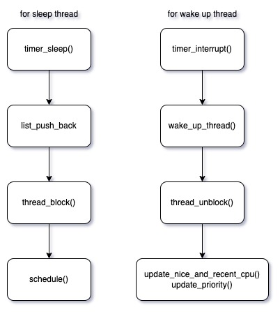
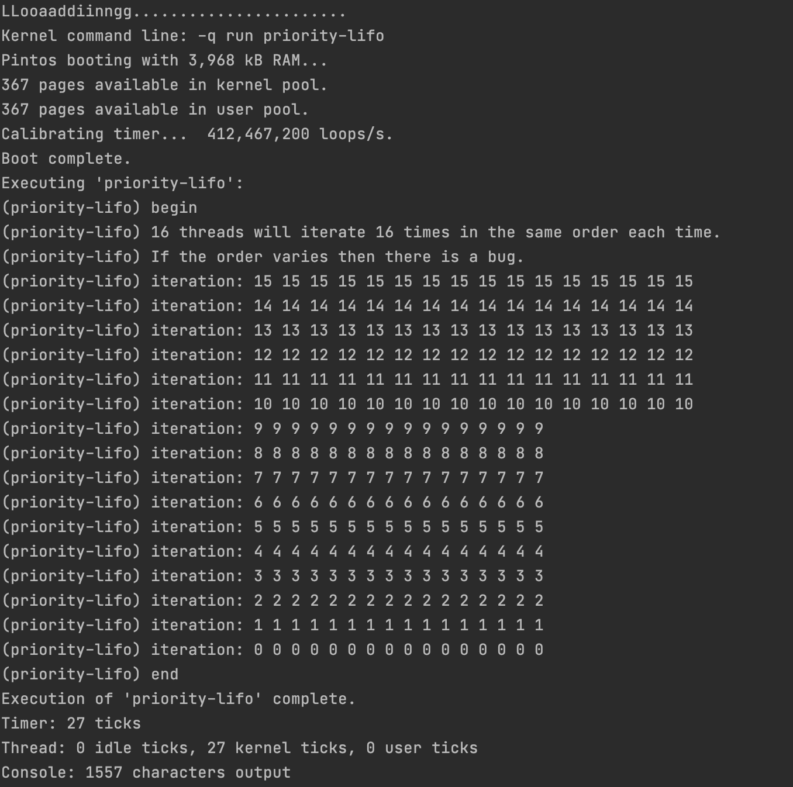
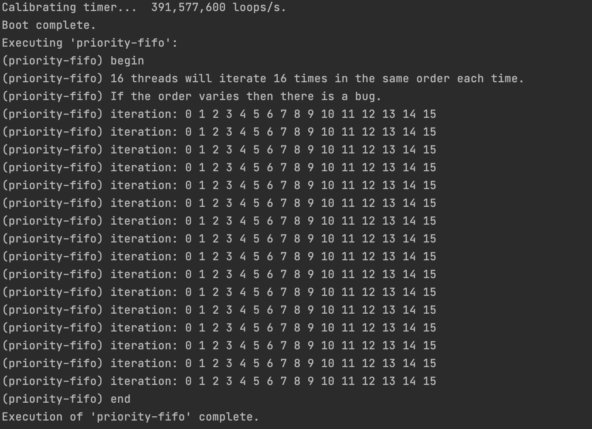
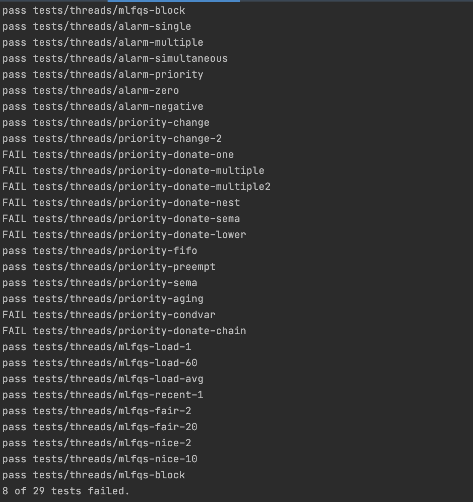

# 1. 개발 목표

- 현재 핀토스는 여러 개의 프로세스 혹은 thread에 대해, 우선 순위를 고려하여 스케줄링할 수 없는 상태이다.
- 우선 순위를 고려하여 스케줄링할 수 있도록 다음의 3가지 동작을 구현한다.
  - `Alarm Clock`
  - `Priority Scheduling`
  - `Advanced Scheduling`

# 2. 개발 범위 및 내용

## A. 개발 범위

### 1) Alarm Clock

- **개발의 필요성**
  - `timer_sleep()`라는 함수는 thread를 sleep 시켜 BLOCKED 상태로 만들 수 있다. 
  - 현재는 `ticks` 만큼 시간이 지나지 않았을 때, while문을 이용하여 `thread_yield()` 함수를 통해  thread를 busy waiting으로 대기시키는 방식으로 thread sleep을 구현하고 있다.
  - 이는 thread가 READY 상태와 RUNNING 상태를 반복하게 되므로, 효율적이지 못하다.
- **개발시 기대되는 결과**
  - BLOCKED된 thread를 대기열 queue에 대기 시키고, 깨어날 시간이 되면 하나씩 부르는 방식으로 효율적으로 개선한다.

### 2) Priority Scheduling

- **개발의 필요성**
  - thread를 ready list에 삽입함에 있어 우선순위를 고려하지 않는다.
  - 현재 핀토스는 여러 개의 프로세스 혹은 thread에 대해, Round Robin 정책으로 프로세스를 실행시킨다.
  - `thread_yield()` 함수 혹은 `thread_unblock()` 함수 호출시 해당 thread는 우선 순위에 관계없이 리스트의 마지막에 push back 된다.
- **개발시 기대되는 결과**
  - thread를 ready list에 삽입할 때, 우선순위를 고려해 삽입하고, 이를 ready list에서 `deque()`할 때, 우선순위가 높은 thread를 얻을 수 있게 된다. 

### 3) Advanced Scheduler

- **개발의 필요성**
  - CPU burst가 높은 thread에 대해 낮은 priority를 부여하고, CPU burst가 낮은 thread에 대해 높은 priority를 부여하면 좋은 사용자 경험을 줄 수 있다.
  - 매 tick마다 thread의 CPU burst를 평가하여, 새로운 priority를 부여할 필요성이 있다.
- **개발시 기대되는 결과**
  - thread의 recent cpu time에 따라 다른 우선 순위를 부여하여, 더 좋은 유저 경험을 주는 thread scheduling이 가능해진다.


## B. 개발 내용

### 1) blocked 상태의 스레드를 깨울 수 있는 방법 

- 재우는 법
  - thread의 속성으로 `time_to_wake_up`를 추가로 설정한다.
  - `time_to_wake_up` 를 현재시간 + `ticks`로 설정하여, 상태를 BLOCKED 상태로 바꾼다.
- 깨우는 법
  - BLOCKED 된 thread들을 관리하는 queue 자료구조 `blocked_list`를 만들어 관리한다.
  - 잠든 thread는 언제 깨어날 지 `time_to_wake_up` 속성을 함께 가지고 있기 때문에, 이 속성을 확인한다.
  - 핀토스에서는 `timer_interrupt()`가 매 tick마다 호출이 되므로 이것을 이용한다.
  - tick이 올라가는 타이밍마다 thread의 `time_to_wake_up`를 평가하고, thread를 깨워주고, thread를 ready queue에 넣어준다.

### 2 ) ready list에 running thread보다 높은 priority를 가진 thread가 들어올 경우 priority scheduling에 따른 처리

- ready list에 running thread보다 높은 priority를 가진 thread가 들어오게 된다면, 그 thread를 실행시켜주어야 한다.
- 따라서 다음과 같은 처리를 해준다.
  - current thread를 READY 상태로 바꾼다. 
  - ready list에 priority를 반영하여 push한다.
  - ready list에 priority가 가장 높은 thread를 선택한다.

### 3 ) Advanced Scheduler에서 priority 계산에 필요한 요소들

- 다음의 3가지 요소가 필요하다.

  - `nice`
  - `recent_cpu`
  - `load_avg`

- 초기화

  - thread가 처음 create된다면, `nice`와 `recent_cpu`는 0으로 초기화한다.
  - thread가 부모로 부터 create 되었다면, 부모 thread의  `nice`와 `recent_cpu` 값을 받는다.

- `nice`

  - -20 ~ 20까지의 값을 가진다.
  - 양수인 nice 값은 priority를 낮추며, 음수인 nice 값은 priority를 높인다.
  - nice 값의 변경에 따라 thread의 priority를 재평가한다.

- `recent_cpu`

  - thread의 CPU burst time을 추정한다. time_intrrupt가 일어나면, RUNNING 상태 thread의 `recent_cpu` 값은 1 증가한다.

  - 매 초마다 RUNNING, READY, BLOCKED의 모든 thread `recent_cpu` 값이 update 된다.
    $$
    recent~cpu = \frac {2*load~avg} {load~avg + 1} * recent~cpu + nice
    $$

- `load_avg`

  - READY 상태 thread의 평균 수를 추정한다.

  - `load_avg`는 매 tick마다 update 된다.
    $$
    load~avg = \left(\frac {59} {60}\right)*load~avg + \left(\frac {1} {60}\right) * ready~threads
    $$

- `priority`
  $$
  priority = PRI~MAX - \left(\frac {recent~cpu} 4\right) - 2 * nice
  $$
  

# 3. 추진 일정 및 개발 방법

## A. 추진 일정

- **day1 ~ day3**
  - **alarm clock** 구현
- **day4 ~ day7**
  - **priority scheduling** 구현
- **day8 ~ day10**
  - **advanced scheduling** 구현
- **day11 ~ day12**
  - 코드 정리 및 오류 디버깅
  - 더 가독성 있는 코드가 되도록 변수명과 함수명을 정리하고, 다른 오류들도 디버깅한다.


## B. 개발 방법

### 1) Alarm Clock

- blocked thread들을 관리할 `blocked_list` 큐 자료구조가 필요하다.
- `time_to_wake_up`을 계산하여, 이를 thread 속성 값으로 부여하고, blocked list에 넣는다.
- busy waiting을 하고 있는 `timer_sleep()`의 코드를 수정하여, busy waiting을 하는 코드를 개선한다.

### 2) Priority Scheduling

- `thread_yield()`와 `thread_unblock()` 함수에서 thread를 ready queue에 삽입할 때, 우선순위를 고려하는 insert를 구현한다.
  - 우선 순위가 고려되어 삽입될 수 있도록, priority 관련 comp 함수를 정의한다.
- `thread_create()` 함수에서 새로 탄생될 thread의 priority의 우선 순위가 current thread의 우선순위보다 더 높다면, 다시 scheduling을 한다.
- `threads/sync.c` 에서 `sema_up()` 함수를 수정한다.
  - sema를 waiters 리스트를 탐색하여 priority가 가장 큰 thread를 찾는다.
  - 해당 thread에 대해 `thread_unblock()` 수행


### 3) Advanced Scheduler

- `threads/threads.h`에 `recent_cpu`와 `nice`, `load_avg`를 추가로 선언
  - 해당 값을 지속 업데이트 하면서, 새로운 priority를 부여한다.
  - 연산은 fixed point 연산을 한다.
- `devices/timer.c`
  - `timer_interrupt()` 함수에서 `thread_prior_aging` tick에 따라 `recent_cpu`,` nice`, `priority`를 업데이트 하는 로직을 추가한다.

# 4. 연구 결과

## A. Flow Chart

### 1 ) Alarm Clock



### 2) Priority Scheduling


### 3 ) Advanced Scheduler


## B. 제작 내용

- `devices/timer.c`

  - `static struct list blocked_list`
    - blocked thread들을 관리한다.

  - `void timer_init(void)`

    ```c
    void timer_init (void)
    {
      ///////// for proj3 - blocked_list 초기화
      list_init(&blocked_list);
      ...
    }
    ```

  - `void timer_sleep (int64_t ticks)`

    ```c
    void timer_sleep (int64_t ticks)
    {
      ...
    
      //while(timer_elapsed(start)<ticks)
    //	  thread_yield();
    
      struct thread *cur = thread_current();
      enum intr_level old_level = intr_disable();
      /////////////////////////////////////
      cur->time_to_wake_up = start + ticks;
      list_push_back(&blocked_list, &cur->elem);
      thread_block();  // thread BLOCKED 상태로 바꿈
      /////////////////////////////////////
      intr_set_level(old_level);
    }
    ```

    - 기존의 busy waiting 코드 삭제
    - thread의 `time_to_wake_up` 속성에 thread가 깨어날 시간을 할당한 뒤에, `blocked_list`에 push한다.

  - `static void timer_interrupt (struct intr_frame *args UNUSED)`

    ```c
    static void timer_interrupt (struct intr_frame *args UNUSED)
    {
      ticks++;
      wake_up_threads();
    
      ///////// proj 3 - priority aging 과 mlfqs 에 대한 처리
      if (thread_prior_aging || thread_mlfqs) {
        thread_current()->recent_cpu += FRACTION;
        if (timer_ticks() % TIMER_FREQ == 0) {
          update_nice_and_recent_cpu();
        }
        if (timer_ticks() % 8 == 0){
          update_priority();
        }
      }
      thread_tick ();
    }
    ```

    - for Alarm Clock
      - tick이 변할 때마다, 새롭게 평가하여 time_to_wake_up 이 된 thread를 깨운다.
    - for Advanced Scheduler
      - `TIMER_FREQ` 전역 상수는 100이다.
      - tick 기준 100 주기마다 nice와 recent cpu를 업데이트 해준다.
      - tick 기준 8 주기마다 priority를 업데이트 해준다.

    

- `threads/threads.h`

  - `struct thread`

  ```c
  struct thread {
    ...
    int time_to_wake_up;  // thread가 깨어나야할 시간
  	int nice;
  	int recent_cpu;
  }
  ```

   - `extern bool thread_prior_aging`

     - priority aging 작업을 위해 bool 선언

   - `static int load_avg`

     - load_avg를 전역으로 선언한다.
       $$
       load~avg = \left(\frac {59} {60}\right)*load~avg + \left(\frac {1} {60}\right) * ready~threads
       $$

     - 위 연산은 fixed point 연산으로 할 수 있도록 한다.

       

- `threads/threads.c`

  - `void thread_unblock (struct thread *t)`

    ```c
    void thread_unblock (struct thread *t)
    {
    	...
    
      //list_push_back (&ready_list, &t->elem);
      list_insert_ordered(&ready_list, &t->elem, thread_priority_comp, NULL);
      t->status = THREAD_READY;
      intr_set_level (old_level);
    }
    ```

    - ready_list 에 단순 삽입이 아닌, 우선순위를 고려한 삽입

  - `void wake_up_threads()`

    ```c
    void wake_up_threads(){
      struct thread* cur;
      struct list_elem* ele = list_begin(&blocked_list);
    
      while (ele != list_end(&blocked_list)) {
        cur = list_entry(ele, struct thread, elem);
    
        if (cur->time_to_wake_up <= ticks) {
          ele = list_remove(ele);
          thread_unblock(cur);
        }
        else {
          ele = list_next(ele);
        }
      }
    }
    ```

    - blocked_list의 모든 원소들을 순회하면서, `time_to_wake_up`이 된 thread를 깨운다.

  - `void thread_yield (void)`

    ```c
    void thread_yield (void)
    {
      struct thread *cur = thread_current ();
      enum intr_level old_level;
    
      ASSERT (!intr_context ());
    
      old_level = intr_disable ();
      ///////////////////////////////
      if (cur != idle_thread) {
        //list_push_back (&ready_list, &cur->elem);
        list_insert_ordered(&ready_list, &cur->elem, thread_priority_comp, NULL);
      }
      
      // 현재 thread 를 READY 상태로 변경
      cur->status = THREAD_READY;
      schedule ();
      ///////////////////////////////
      intr_set_level (old_level);
    }
    ```

    - `thread_yield()` 함수는 현재 thread를 READY 상태로 만들고 reschedule하는 함수이다.
    - 현재 thread를 ready list에 삽입하되, priority를 반영하여 집어넣게 된다.
      - 이는 `list_remove()`시 priority가 가장 높은 thread를 얻기 위함이다.

  - `bool thread_priority_comp (const struct list_elem * left, const struct list_elem * right, void *aux)`

    ```c
    bool thread_priority_comp (const struct list_elem * left, const struct list_elem * right, void *aux){
      struct thread* l = list_entry(left, struct thread, elem);
      struct thread* r = list_entry(right, struct thread, elem);
      return l->priority > r->priority;
    }
    ```

    	- priority가 높은 순서로 내림차순 정렬될 수 있도록 comp 함수를 정의한다.

  - `tid_t thread_create (const char *name, int priority, thread_func *function, void *aux)`

    ```c
    tid_t thread_create (const char *name, int priority, thread_func *function, void *aux)
    {
      ...
    
      /* Add to run queue. */
      thread_unblock (t);
      if (!list_empty(&ready_list) && thread_get_priority() < priority){
        thread_yield();
      }
      return tid;
    }
    ```

    - 새로 create할 thread의 priority가 현재 thread의 prority보다 높다면, 이는 CPU 스케줄링을 새로 해주어야 하는 상황이 된다.
    - `thread_yield()` 함수를 불러 rescheduling한다.

  - `void thread_set_priority (int new_priority)`

    ```c
    void thread_set_priority (int new_priority)
    {
      int old_priority = thread_current()->priority;
      thread_current ()->priority = new_priority;
    
      if (new_priority < old_priority) {
        thread_yield();
      }
    }
    ```

    - 새로이 set 하게될 priority가 값이 더 작아진다면, rescheduling이 필요하게 된다.
    - `thread_yield()` 함수를 불러 rescheduling한다.

  - `void thread_set_nice (int nice)`

    ```c
    void thread_set_nice (int nice)
    {
      struct thread * cur = thread_current();
      cur->nice = nice;
      cur->priority = PRI_MAX*FRACTION - (cur->recent_cpu/4) - ((nice*FRACTION) *2)/FRACTION;
    
      if (cur->priority < PRI_MIN) {
        cur->priority = PRI_MIN;
      }
      else if (cur->priority > PRI_MAX) {
        cur->priority = PRI_MAX;
      }
    }
    ```

    - 인자로 넘겨 받은 `nice` 값으로 thread의 `nice` 값을 설정한다.

    - `nice` 값에 따라 thread의 `priority`도 새롭게 결정한다.

    - 새로 할당한 priority가 `PRI_MIN` 밑으로 떨어지거나 `PRI_MAX`를 넘어버리는 경우를 조정해 준다.
      $$
      priority = PRI~MAX - \left(\frac {recent~cpu} 4\right) - 2 * nice
      $$

    - 위의 연산은 fixed point 연산으로 할 수 있도록 한다.

  - `void update_nice_and_recent_cpu(void)`

    ```c
    void update_nice_and_recent_cpu(void){
      int ready = list_size(&ready_list);
    
      if (thread_current() != idle_thread) {
        ready++;
      }
    
      // 여기서 ready는 READY와 RUNNING을 모두 합친 숫자
      load_avg = (59*load_avg)/60 + (ready*FRACTION)/60;
    
      struct thread* cur;
      struct list_elem* ele = list_begin(&all_list);
      while (ele != list_end(&all_list)) {
        cur = list_entry(ele, struct thread, allelem);
        if (cur == idle_thread) {
          ele = list_next(ele);
          continue;
        }
    
        cur->recent_cpu = ((int64_t)((int64_t)2*load_avg)*FRACTION / (2*load_avg+1*FRACTION)) * (cur->recent_cpu)/FRACTION + (cur->nice)*FRACTION;
        ele = list_next(ele);
      }
    }
    ```

    - `all_list`의 모든 원소들(thread)을 순회하면서, thread의 `recent_cpu` 값을 업데이트 해준다.

    $$
    recent~cpu = \frac {2*load~avg} {load~avg + 1} * recent~cpu + nice
    $$

    - 위의 연산은 fixed point 연산으로 할 수 있도록 한다.

  - `void update_priority(void)`

    ```c
    void update_priority(void) {
      struct thread *cur;
    
      struct list_elem* ele = list_begin(&all_list);
      while (ele != list_end(&all_list)) {
        cur = list_entry(ele, struct thread, allelem);
        cur->priority = (PRI_MAX*FRACTION - (cur->recent_cpu/4)-(cur->nice *2)*FRACTION)/FRACTION;
    
        // MIN 밑으로 떨어지거나 MAX를 넘어버리는 경우를 조정
        if (cur->priority < PRI_MIN) {
          cur->priority = PRI_MIN;
        }
        else if (cur->priority > PRI_MAX) {
          cur->priority = PRI_MAX;
        }
    
        ele = list_next(ele);
      }
    }
    ```

    - `all_list`의 모든 원소들(thread)을 순회하면서, thread의 `priority` 값을 업데이트 해준다.
      $$
      priority = PRI~MAX - \left(\frac {recent~cpu} 4\right) - 2 * nice
      $$
    
  - 위의 연산은 fixed point 연산으로 할 수 있도록 한다.
  
- `threads/sync.c`

  - `void sema_up (struct semaphore *sema)`

  ```c
  void sema_up (struct semaphore *sema) 
  {
    enum intr_level old_level;
  
    ASSERT (sema != NULL);
  
    old_level = intr_disable ();
  
  //  if (!list_empty (&sema->waiters))
  //    thread_unblock (list_entry (list_pop_front (&sema->waiters),
  //                                struct thread, elem));
  
    if (!list_empty(&sema->waiters)) {
      struct list_elem *ele_having_max_pri = list_begin(&sema->waiters);
      struct thread *thread_having_max_pri = list_entry(ele_having_max_pri, struct thread, elem);
  
      struct thread* cur;
      struct list_elem* ele = list_begin(&sema->waiters);
      while (ele != list_end(&sema->waiters)) {
        cur = list_entry(ele, struct thread, elem);
  
        if (cur->priority > thread_having_max_pri->priority) {
          thread_having_max_pri = cur;
          ele_having_max_pri = ele;
        }
        ele = list_next(ele);
      }
  
      list_remove(ele_having_max_pri);
      thread_unblock (thread_having_max_pri);
    }
  
    sema->value++;
    intr_set_level (old_level);
  
    //////// for proj3
    thread_yield();
  }
  ```

  - sema->waiters 에 대기하고 있는 모든 원소(thread)들을 순회한다.
  - 순회의 목적은 최대 priority를 갖는 thread를 찾고 이를 UNBLOCKED 하기 위함이다.
  - 위의 로직은 크게 최대 priority를 갖는 thread를 찾는 과정과 해당 thread를 remove하는 과정 2가지로 나위어져 있다.
  - semaphore 값을 올려준 뒤, `thread_yield()` 함수를 호출하여, rescheduling한다.

  

  

## C. 시험 및 평가 내용

### `../utils/pintos -v -- -q run priority-lifo` 테스트 결과 분석

  - `test/threads/priority-lifo.c` 코드 분석

    ```c
    void test_priority_lifo (void) 
    {
      ...
    
      thread_set_priority (PRI_DEFAULT + THREAD_CNT + 1);
      for (i = 0; i < THREAD_CNT; i++) 
        {
          char name[16];
          struct simple_thread_data *d = data + i;
          snprintf (name, sizeof name, "%d", i);
          d->id = i;
          d->iterations = 0;
          d->lock = &lock;
          d->op = &op;
          thread_create (name, PRI_DEFAULT + 1 + i, simple_thread_func, d);
        }
    ...
    }
    ```

    - 해당 코드를 보면, `thread_create()`를 호출할 때, priority에 해당하는 인자의 값을 하나씩 올려 스레드를 create하는 것을 관찰할 수 있다.
    - 그렇데 되면, 나중에 생성된 thread가 우선순위가 높게 되어, 나중에 들어온 thread가 먼저  CPU 스케줄 된다.
    - 즉, Last In First Out이 수행되는 것이다.

- **결과**

  

  - 위의 결과를 보면, 15번 thread가 가장 먼저 CPU 스케줄 되고, 계속 우선순위가 높은 15번 thread가 수행되는 것을 관찰할 수 있다.

  - 계속 동일한 우선순위를 주면서 `thread_create()` 하여, First In First out을 수행하는 `../utils/pintos -v -- -q run priority-fifo`의 경우와 비교하면, 선명히 비교할 수 있다.

    - 참고 (FIFO)

      


### `make check` 수행 결과를 캡쳐


